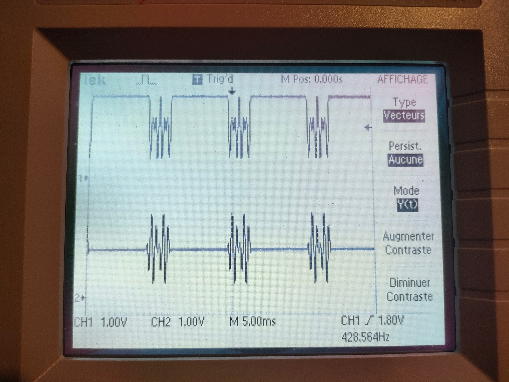
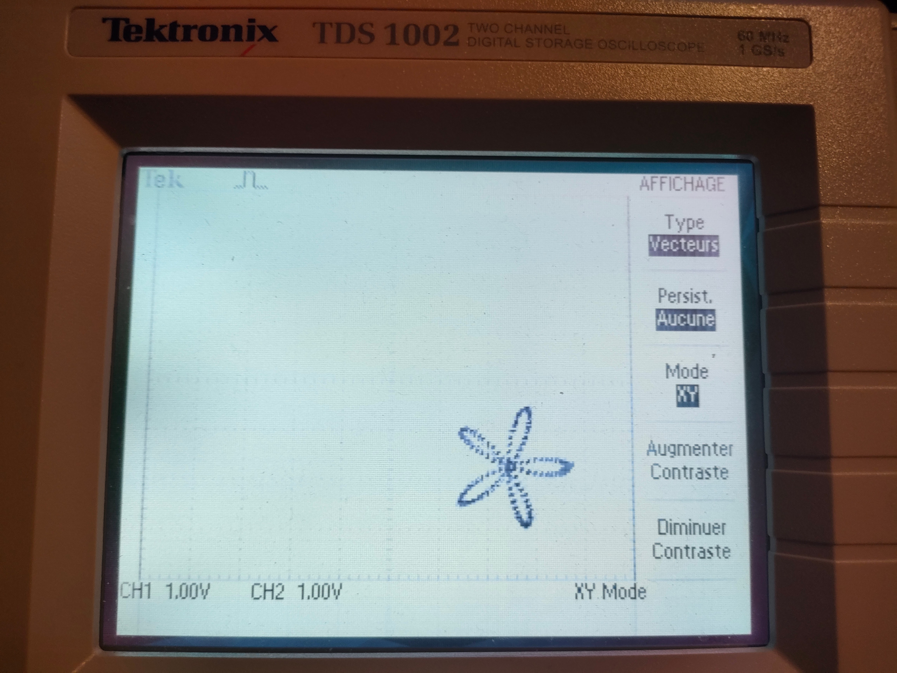
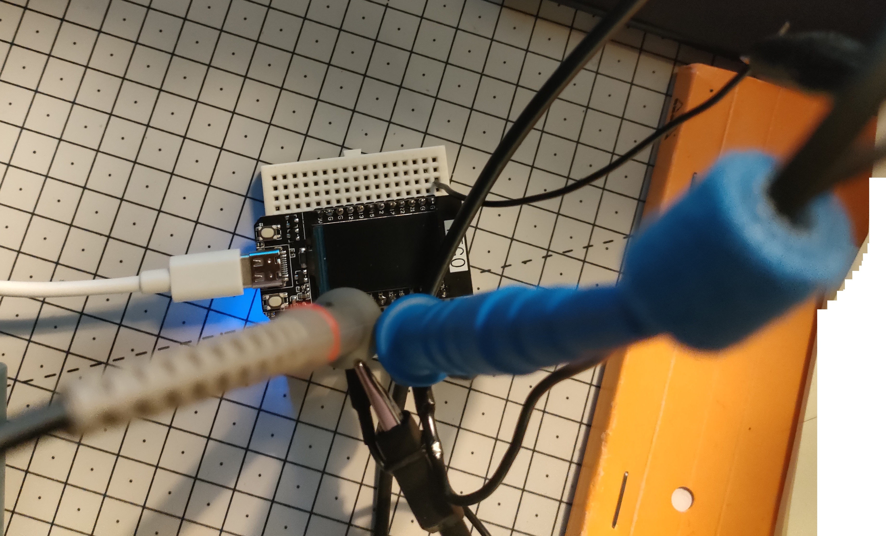

# 🎨 ESP32 Oscilloscope Art Generator

> **Transform your oscilloscope into an artistic canvas using ESP32's built-in dual DACs**

This example demonstrates how to create stunning oscilloscope art patterns using the ESP32's built-in DAC channels. The generated XY coordinates are output through GPIO25 (X-axis) and GPIO26 (Y-axis) to create beautiful mathematical patterns on an oscilloscope display.

## ✨ Features

- 🎯 **Dual DAC Output** - Uses ESP32's built-in DAC1 (GPIO25) and DAC2 (GPIO26)
- 🌹 **18+ Art Patterns** - Circles, roses, hearts, butterflies, and more
- ⚡ **Real-time Rendering** - Smooth pattern display with adjustable speed
- 🔧 **Easy Setup** - Just connect two wires to your oscilloscope
- 📱 **PlatformIO Ready** - Upload and run immediately

## 🖼️ Gallery

### Circle Pattern
*Perfect mathematical circle rendered in real-time*

| Time Domain (T-X, T-Y) | XY Display |
|---|---|
|  |  |

The time domain view shows how X and Y coordinates change over time (sine and cosine waves), while the XY display shows the resulting circular pattern.

### Rose Pattern (5-petal)
*Beautiful 5-petal rose using parametric equations*

| Time Domain (T-X, T-Y) | XY Display |
|---|---|
|  |  |

The rose pattern demonstrates more complex mathematical relationships, creating an intricate floral design.

### Hardware Setup

*ESP32 development board ready for oscilloscope art generation*

## 🔌 Hardware Setup

### Required Components
- **ESP32 Development Board** (any variant with DAC pins)
- **Oscilloscope** with XY mode capability
- **2x BNC cables** or probe wires
- **Breadboard jumper wires** (optional for easier connections)

### Wiring Diagram
```
ESP32 Pins → Oscilloscope
├── GPIO25 (DAC1) → Channel 1 (X-axis)
├── GPIO26 (DAC2) → Channel 2 (Y-axis)
└── GND         → Ground
```

### Oscilloscope Settings
1. **Set to XY Mode** - Most oscilloscopes have an XY button
2. **Adjust Voltage Scale** - Start with 1V/div on both channels
3. **Center the Display** - Use position controls to center the pattern
4. **Fine-tune Speed** - Adjust timebase if needed for smooth display

## 🚀 Quick Start

### 1. Flash the Firmware
```bash
# Clone the repository
git clone https://github.com/s-celles/waveform-generator.git
cd waveform-generator/exemples/esp32

# Flash using PlatformIO
pio run --target upload

# Or using Arduino IDE
# Open src/main.cpp and upload to your ESP32
```

### 2. Connect Hardware
- Connect GPIO25 to oscilloscope Channel 1 (X-axis)
- Connect GPIO26 to oscilloscope Channel 2 (Y-axis)  
- Connect ESP32 GND to oscilloscope ground

### 3. Configure Oscilloscope
- Set oscilloscope to **XY mode**
- Adjust voltage scale to **1V/div** on both channels
- Center the display using position controls

### 4. Enjoy the Art!
The ESP32 will immediately start generating patterns. You should see beautiful mathematical art on your oscilloscope display.

## 🔧 Customization

### Change Patterns
Edit `src/main.cpp` to switch between different patterns:

```cpp
// Current pattern (rose)
dac_output_voltage(DAC_CHANNEL_1, rose_5_x[i]);
dac_output_voltage(DAC_CHANNEL_2, rose_5_y[i]);

// Switch to circle
dac_output_voltage(DAC_CHANNEL_1, circle_x[i]);
dac_output_voltage(DAC_CHANNEL_2, circle_y[i]);

// Or try other patterns: heart, butterfly, lissajous, etc.
```

### Available Patterns
The `xy_waveforms.h` file includes these artistic patterns:
- 🔵 **circle** - Perfect mathematical circle
- 🌹 **rose_5** - 5-petal rose pattern  
- ❤️ **heart** - Romantic heart shape
- 🦋 **butterfly** - Complex butterfly curve
- ∞ **lissajous** - Classic figure-8 patterns
- 🌀 **spiral** - Logarithmic and linear spirals
- ⭐ **star** - Various star patterns
- 🌸 **flower** - Multiple flower varieties

### Adjust Speed
Modify the delay in the main loop to change pattern speed:

```cpp
// Faster drawing
delayMicroseconds(5);    // Very fast

// Normal speed  
delayMicroseconds(10);   // Default

// Slower, more detailed
delayMicroseconds(50);   // Slower for complex patterns
```

### Pattern Cycling
Add automatic pattern cycling:

```cpp
void loop() {
    static int pattern = 0;
    static unsigned long lastChange = 0;
    
    if (millis() - lastChange > 5000) {  // Change every 5 seconds
        pattern = (pattern + 1) % 3;     // Cycle through 3 patterns
        lastChange = millis();
    }
    
    for (uint16_t i = 0; i < XY_ARRAY_SIZE; i++) {
        switch(pattern) {
            case 0:
                dac_output_voltage(DAC_CHANNEL_1, circle_x[i]);
                dac_output_voltage(DAC_CHANNEL_2, circle_y[i]);
                break;
            case 1:
                dac_output_voltage(DAC_CHANNEL_1, rose_5_x[i]);
                dac_output_voltage(DAC_CHANNEL_2, rose_5_y[i]);
                break;
            case 2:
                dac_output_voltage(DAC_CHANNEL_1, heart_x[i]);
                dac_output_voltage(DAC_CHANNEL_2, heart_y[i]);
                break;
        }
        delayMicroseconds(10);
    }
}
```

## 📈 Technical Details

### ESP32 DAC Specifications
- **Resolution:** 8-bit (0-255 values)
- **Voltage Range:** 0V to 3.3V  
- **Sample Rate:** Up to 1 MHz theoretical
- **Actual Speed:** ~100kHz with delayMicroseconds(10)

### Pattern Mathematics
Each pattern is generated from parametric equations:

**Circle:**
```
x(t) = cos(2πt) 
y(t) = sin(2πt)
```

**Rose (5-petal):**
```
x(t) = cos(5t) × cos(t)
y(t) = cos(5t) × sin(t)  
```

**Heart:**
```
x(t) = 16sin³(t)
y(t) = 13cos(t) - 5cos(2t) - 2cos(3t) - cos(4t)
```

## 🎓 Educational Value

This project is perfect for:
- **Electronics Education** - Learn about DACs and analog output
- **Mathematics Visualization** - See parametric equations come to life
- **Signal Processing** - Understand XY plotting and waveform generation
- **Embedded Programming** - Practice with ESP32 and real-time output
- **Art & Technology** - Combine mathematics with visual art

## 🔍 Troubleshooting

### Pattern Not Visible
- Check oscilloscope is in XY mode (not normal timebase mode)
- Verify wiring: GPIO25→CH1, GPIO26→CH2, GND→GND
- Adjust voltage scale (try 0.5V/div to 2V/div)
- Center the display using position controls

### Pattern Too Fast/Slow
- Increase `delayMicroseconds()` value to slow down
- Decrease delay value to speed up
- Try values between 5-100 microseconds

### Distorted Patterns
- Check ground connection between ESP32 and oscilloscope
- Ensure stable power supply to ESP32
- Try different oscilloscope probe compensation
- Verify ESP32 DAC pins are not damaged

### Serial Monitor Output
The code includes debug output. Connect to serial monitor at 115200 baud to see:
```
ESP32 XY DAC Display Starting...
DAC channels initialized
Connect oscilloscope:
- X channel (DAC1): GPIO25  
- Y channel (DAC2): GPIO26
- Set oscilloscope to XY mode
```

## 🎨 Creative Extensions

### Add Interactive Controls
- **Potentiometers** to adjust pattern speed and scale
- **Buttons** to cycle through different patterns
- **Web Interface** for remote pattern selection

### Pattern Mixing
- **Blend patterns** by combining X,Y coordinates
- **Add rotation** by applying rotation matrices
- **Scale and offset** patterns dynamically

### Audio Reactive
- **Microphone input** to make patterns react to sound
- **Beat detection** to change patterns with music
- **Frequency analysis** to modulate pattern parameters

## 🔗 Related Projects

- **[Main Waveform Generator](../../)** - Generate custom patterns
- **[Arduino Examples](../arduino/)** - Arduino-based implementations  
- **[STM32 Examples](../stm32/)** - Higher resolution 12-bit patterns
- **[Display Examples](../esp32-display/)** - LCD/OLED pattern preview

## 📚 References

- [ESP32 DAC Documentation](https://docs.espressif.com/projects/esp-idf/en/latest/esp32/api-reference/peripherals/dac.html)
- [Oscilloscope XY Mode Guide](https://www.tek.com/en/documents/primer/xy-displays-oscilloscopes)
- [Parametric Equations](https://en.wikipedia.org/wiki/Parametric_equation)
- [Mathematical Art Patterns](https://mathworld.wolfram.com/topics/PlaneCurves.html)

---

**🌟 Star the main repository if this helped you create amazing oscilloscope art!**

*Transform mathematics into visual beauty with ESP32 and oscilloscopes* ✨